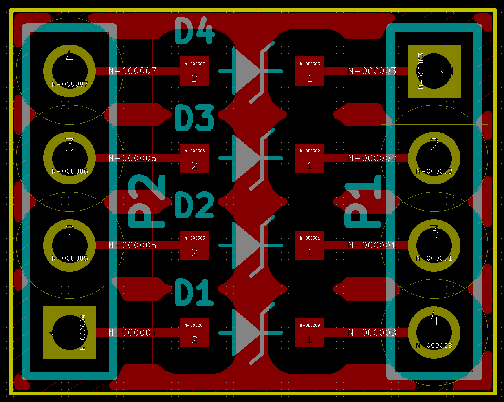

# Zener Breakout

This is a breakout board for 4 [BZT52C3V6](http://www.diodes.com/_files/datasheets/ds18004.pdf) (pdf warning) zener diodes (they're packaged
as SOD123, so this should work for those too).
