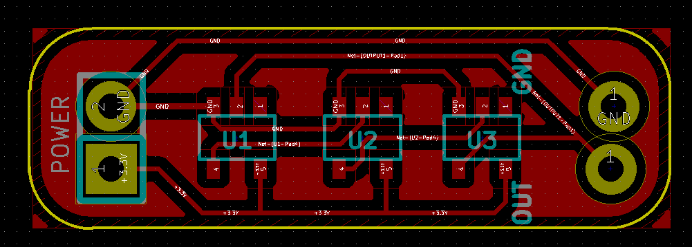

# Ring oscillator

A [ring oscillator](https://en.wikipedia.org/wiki/Ring_oscillator) that was used for a demo. Gerbers are setup for milling on FR-1. Please re-generate to fulfill your fab house's requirements if you're going that route.

(The little ears on the edges of the copper fill don't get milled off. The board isn't all that big, so there isn't much waste.)

## Parts used:

* 3x SN74LVC1GU04DBVR

* 2x 2-pin 2.54mm/0.1" headers (for input/output and power)

## Assembly

The ICs can be soldered by hand using a one-leg tack method. Solder one leg, straighten the IC slightly (as necessary),
and solder an opposing leg. Solder the rest, and heat up the first leg to relieve any strain.

For long term use it's probably best to go with solder paste+hot air reflow, and a proper PCB.

---

Solder in the headers too, but be sure to mark which output is which (since there won't be any silkscreen).

## License

[CC 1.0 Universal](https://creativecommons.org/publicdomain/zero/1.0/)
